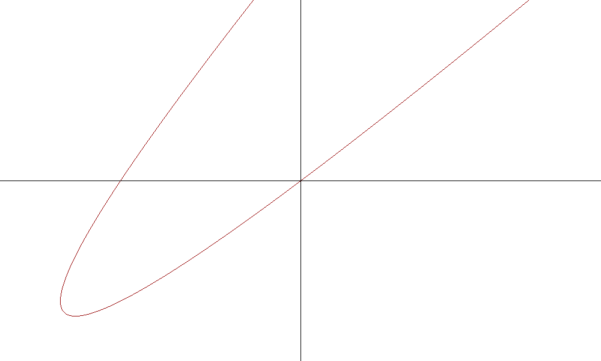

## First task
Program draws random parabola of the type ```ax + by + c*(x - y)^2 = 0``` on \[x1,x2\]×\[y1,y2\] using Bresenham's algorithm.

### Example
**-6x + 8y -(x - y)^2 = 0** on **[-10,10]×[-6,6]**

